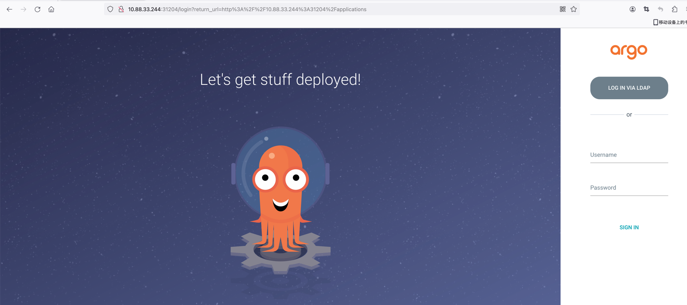
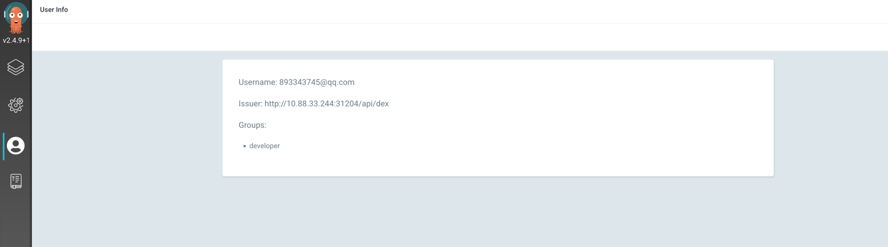
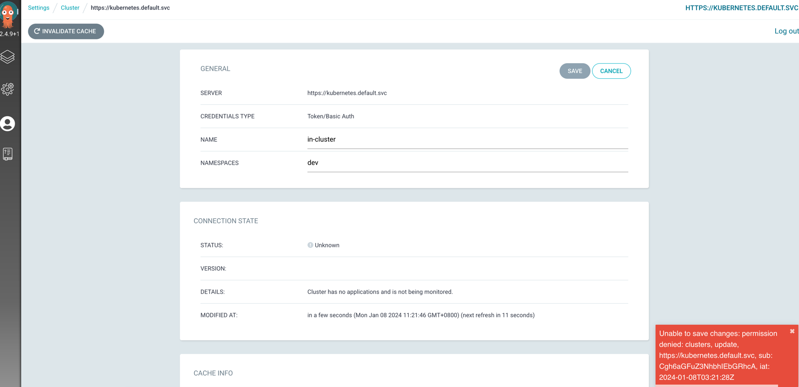

1.argocd开启ldap
```
apiVersion: v1
kind: ConfigMap
metadata:
  labels:
    app.kubernetes.io/name: argocd-cm
    app.kubernetes.io/part-of: argocd
  name: argocd-cm
data:
  resource.customizations: |
    apps/Deployment:
      ignoreDifferences: |
        jsonPointers:
        - /spec/replicas
    autoscaling/HorizontalPodAutoscaler:
      ignoreDifferences: |
        jsonPointers:
        - /spec/maxReplicas
        - /spec/minReplicas
  dex.config: |-
    connectors:
    - type: ldap
      name: LDAP
      id: ldap
      config:
        # Ldap server address
        host: 172.19.100.1:32238
        insecureNoSSL: true
        insecureSkipVerify: true
        # Variable name stores ldap bindDN in argocd-secret
        bindDN: "cn=admin,dc=devops,dc=com"
        # Variable name stores ldap bind password in argocd-secret
        bindPW: "123456"
        # Ldap user serch attributes
        userSearch:
          baseDN: "ou=people,dc=devops,dc=com"
          filter: ""
          username: uid
          idAttr: uid
          emailAttr: mail
          nameAttr: displayName
        groupSearch:
          baseDN: ou=hundunyun,dc=devops,dc=com
          filter: "(objectClass=groupOfNames)"
          userAttr: DN
          groupAttr: member
          nameAttr: cn
  url: http://10.88.33.244:31204  # argocd的http地址
```

2.重启argocd-dex-server和argocd-server服务
```
[root@k8s-syj ~]# kubectl delete deployments.apps -n argocd argocd-dex-server argocd-server
```
3.测试登录,页面点击**lOGIN IN VIA LDAP**,顺便查看argocd-dex-server的日志
```
[root@k8s-syj ~]# kubectl logs -f -n argocd argocd-dex-server-7c8cb86d64-g72m5
····
time="2024-01-08T03:18:49Z" level=info msg="performing ldap search ou=people,dc=devops,dc=com sub (uid=zhangsan)"
time="2024-01-08T03:18:49Z" level=info msg="username \"zhangsan\" mapped to entry uid=zhangsan,ou=people,dc=devops,dc=com"
time="2024-01-08T03:18:49Z" level=error msg="ldap: invalid password for user \"uid=zhangsan,ou=people,dc=devops,dc=com\""
time="2024-01-08T03:18:52Z" level=info msg="performing ldap search ou=people,dc=devops,dc=com sub (uid=zhangsan)"
time="2024-01-08T03:18:52Z" level=info msg="username \"zhangsan\" mapped to entry uid=zhangsan,ou=people,dc=devops,dc=com"
time="2024-01-08T03:18:52Z" level=info msg="performing ldap search ou=hundunyun,dc=devops,dc=com sub (&(objectClass=groupOfNames)(member=uid=zhangsan,ou=people,dc=devops,dc=com))"
time="2024-01-08T03:18:52Z" level=info msg="login successful: connector \"ldap\", username=\"张三\", preferred_username=\"\", email=\"893343745@qq.com\", groups=[\"developer\"]"
```

5.开启权限配置
```
apiVersion: v1
kind: ConfigMap
metadata:
  name: argocd-rbac-cm
  namespace: argocd
data:
  policy.csv: |
    p, role:admin, *, *, *, allow
    p, role:devops, applications, sync, *, allow
    p, role:devops, logs, get, *, allow
    g, ops, role:admin
    g, tester, role:devops
    g, developer, role:devops
  policy.default: role:readonly
```
