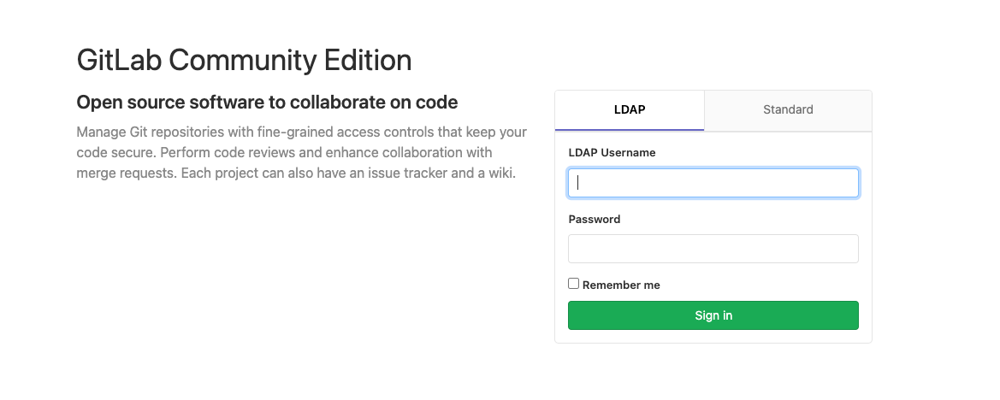
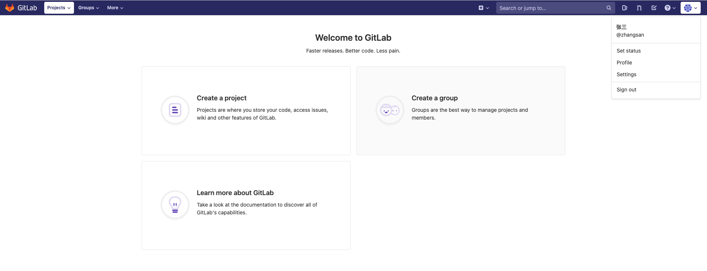

1.开启gitlab对接
```
[root@test-169 ~]# grep -vE '^#|^$' /etc/gitlab/gitlab.rb
external_url 'http://gitlab.example.com'
gitlab_rails['ldap_enabled'] = true
gitlab_rails['ldap_servers'] = YAML.load <<-'EOS'
main: # 'main' is the GitLab 'provider ID' of this LDAP server
label: 'LDAP'
host: '172.19.100.1' # ldap地址
port: 32238          # ldap端口
uid: 'uid'           # ldap登录的用户名
bind_dn: 'cn=admin,dc=devops,dc=com' # ldap管理员账号
password: '123456'                   # ldap管理员密码
encryption: 'plain' #加密
verify_certificates: true
smartcard_auth: false
active_directory: false # 是否使用Active Directory认证，可选false
allow_username_or_email_login: true # 开启邮箱登录
lowercase_usernames: true # 系统转换用户名称为小写
block_auto_created_users: false   # 不允许用户注册
base: 'ou=people,dc=devops,dc=com' # 哪一层读取用户信息
attributes:
username: ['cn','uid']
email: ['mail', 'email']
name: 'displayName'
EOS
```
2.加载配件文件,重启服务
```
[root@test-169 ~]# gitlab-ctl reconfigure
[root@test-169 ~]# gitlab-ctl restart
[root@test-169 ~]# gitlab-ctl status
```
3.页面开启已支持ldap登录,**注:原root还是可以登录**

4.测试登录

