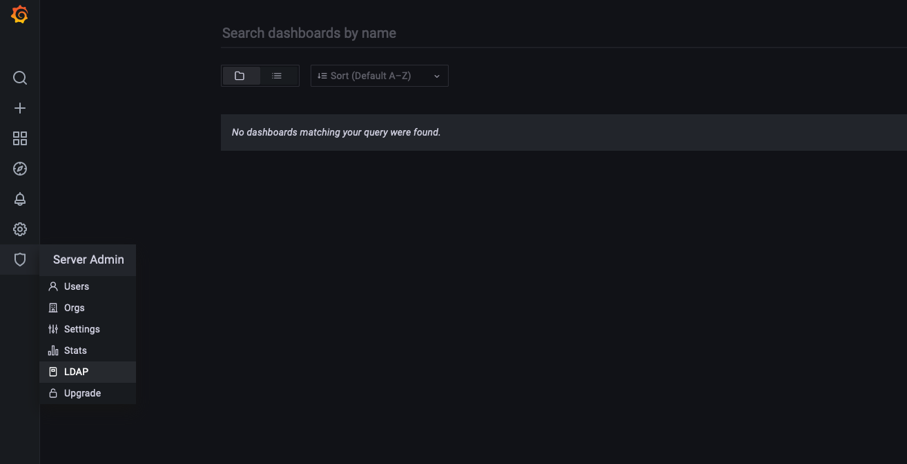
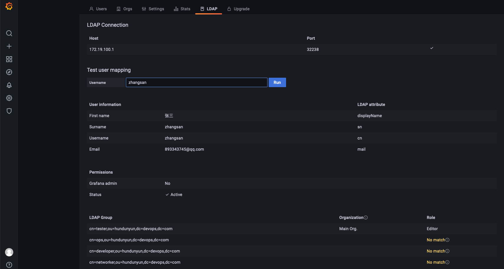

1.grafana对接ldap
```
[root@test-169 ~]#  vim /etc/grafana/grafana.ini
[auth.ldap]
enabled = true
config_file = /etc/grafana/ldap.toml
allow_sign_up = true
-------------------------------
[root@test-169 ~]# grep -vE '^#|^$' /etc/grafana/ldap.toml
[[servers]]
host = "172.19.100.1"
port = 32238
use_ssl = false
start_tls = false
ssl_skip_verify = false
bind_dn = "cn=admin,dc=devops,dc=com"
bind_password = '123456'
search_filter = "(uid=%s)"
search_base_dns = ["dc=devops,dc=com"]
group_search_filter = "(objectClass=groupOfNames)"
group_search_base_dns = ["ou=hundunyun,dc=devops,dc=com"]
group_search_filter_user_attribute = "member"
[servers.attributes]
name = "displayName"
surname = "sn"
username = "cn"
member_of = "memberOf"
email =  "mail"
[[servers.group_mappings]]
group_dn = "cn=ops,ou=hundunyun,dc=devops,dc=com"
org_role = "Admin"
[[servers.group_mappings]]
group_dn = "cn=tester,ou=hundunyun,dc=devops,dc=com"
org_role = "Editor"
[[servers.group_mappings]]
group_dn = "*"
org_role = "Viewer"
```
2.查看ldap是否成功

3.验证用户
