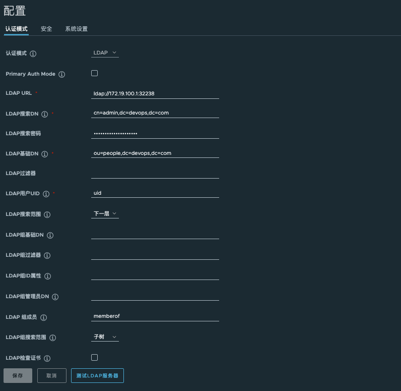
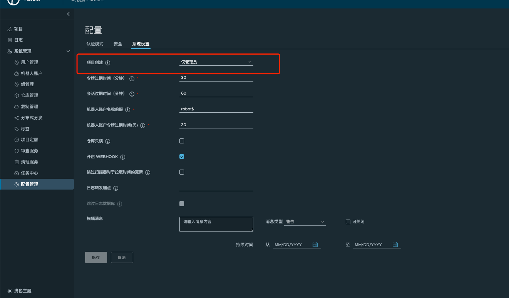

1.部署harbor
```
[root@test-169 ~]# wget https://github.com/goharbor/harbor/releases/download/v2.10.0/harbor-online-installer-v2.10.0.tgz
[root@test-169 ~]#  tar xf harbor-online-installer-v2.10.0.tgz
[root@test-169 harbor]# cp harbor.yml.tmpl  harbor.yml
[root@test-169 harbor]#  sh install.sh
```
2.对接ldap,**系统管理**>**配置管理**>**认证模式**

3.**系统管理**>**配置管理**>**系统管理**
