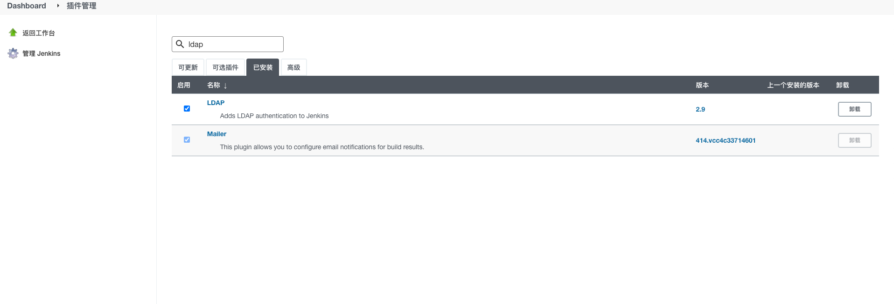
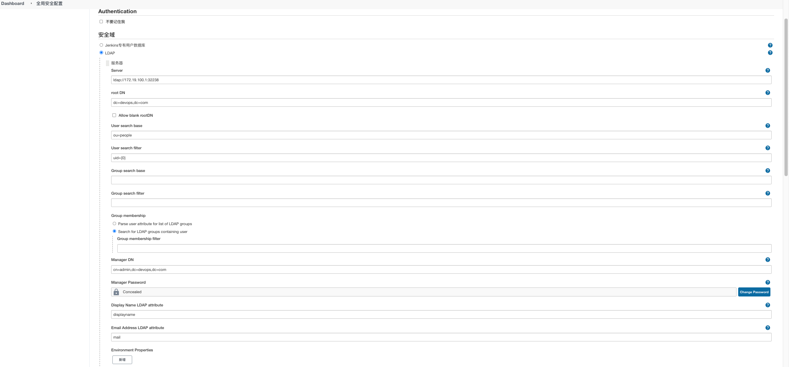
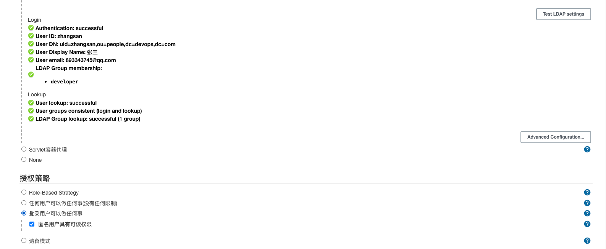
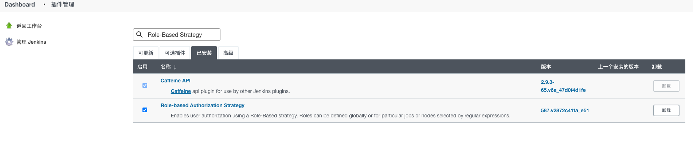
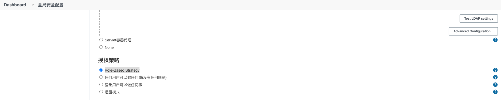
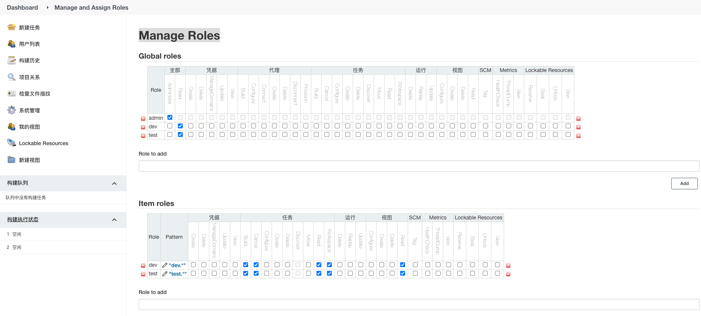
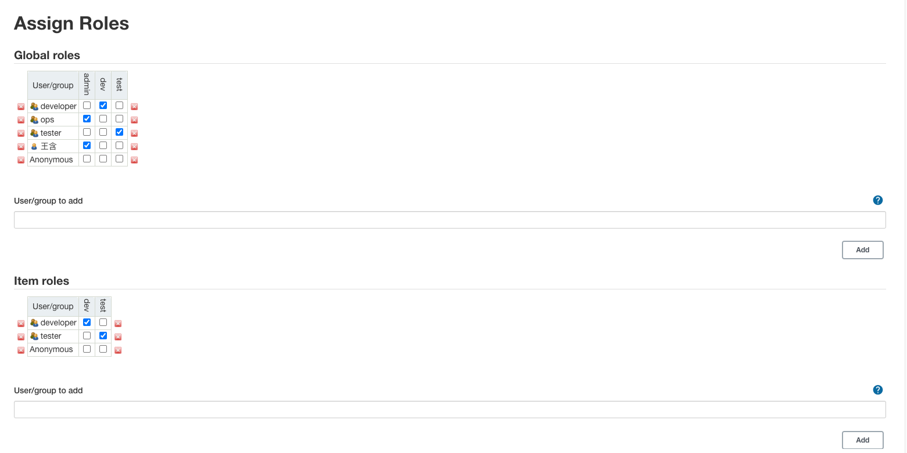
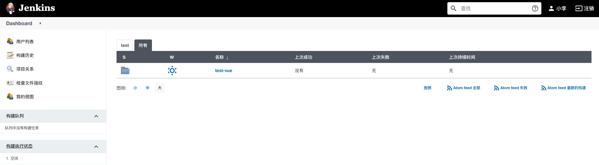
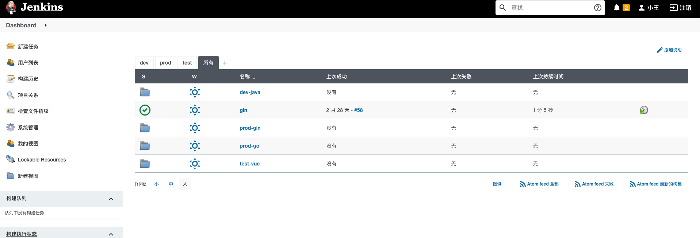

1.jenkins安装**ldap**插件

2.配置ldap,**系统管理**>**全局安全配置**

3.配置完成点击**Test LDAP settings** ,此时可以用其中一个账号密码进行测试，看到如下输出，则说明配置成功,注:**授权策略**>**登录用户可以做任何事**。ldap对接成功,jenkins原有账号会**失效**

4.授权,安装插件**Role-Based**

5.配置权限,**系统管理**-**全局安全配置**>**授权策略**>**Role-Based Strategy**

6.**系统管理**>**Manage and Assign Roles**>**Manage Roles**

7.**系统管理**>**Manage and Assign Roles**>**Manage Roles**>**Assign Roles**,这里的**developer/tester/ops**是对接的ldap分组,这边选择ADD

8.**developer**组下成员查看

9.**tester**组下成员查看

10.**ops**组下成员查看
