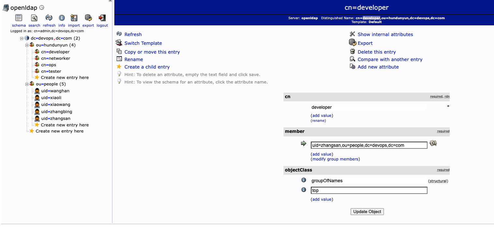

1. ldap服务k8s安装
   -  [web部署和用户管理思路以及密码自助修改 | 二丫讲梵 (eryajf.net)](https://wiki.eryajf.net/pages/3414.html#_1-配置管理端。) 
   - 新的ldap：https://github.com/eryajf/go-ldap-admin
```yaml
[root@k8s-uat-manager demo]# cat ldap.yaml
apiVersion: apps/v1
kind: Deployment
metadata:
  name: openldap
  namespace: infra
  annotations:
    app.kubernetes.io/alias-name: LDAP
    app.kubernetes.io/description: 认证中心
spec:
  selector:
    matchLabels:
      app: openldap
  template:
    metadata:
      labels:
        app: openldap
    spec:
      containers:
      - name: openldap
        image: registry.cn-hangzhou.aliyuncs.com/zhenhuan/openldap:1.5.0
        securityContext:
        # 设置以ROOT用户运行容器
          runAsUser: 0
          privileged: true
        env:
        - name: TZ
          value: Asia/Shanghai
        # 配置LDAP组织名称 登录账号为 cn=admin,dc=devops,dc=com
        - name: LDAP_ORGANISATION
          value: "devops"
        # 配置 LDAP 域名
        - name: LDAP_DOMAIN
          value: "devops.com"
        #  LDAP 密码
        - name: LDAP_ADMIN_PASSWORD
          value: "123456"
        - name: LDAP_CONFIG_PASSWORD
          value: "123456"
        - name: LDAP_BACKEND
          value: mdb
        ports:
        - containerPort: 389
          name: ldap-389
          protocol: TCP
        - containerPort: 636
          name: ldap-636
          protocol: TCP
        #资源限制根据实际情况配置
        resources:
          limits:
            cpu: 1000m
            memory: 1000Mi
          requests:
            cpu: 500m
            memory: 500Mi
        volumeMounts:
        - name: ldap-config-pvc
          mountPath: /etc/ldap/sldap.d
        - name: ldap-data-pvc
          mountPath: /var/lib/ldap
      volumes:
      - name: ldap-config-pvc
        persistentVolumeClaim:
          claimName: ldap-config-pvc
      - name: ldap-data-pvc
        persistentVolumeClaim:
          claimName: ldap-data-pvc
---
apiVersion: v1
kind: Service
metadata:
  name: openldap
  namespace: infra
  labels:
    app: openldap
spec:
  ports:
  - name: ldap-389
    port: 389
    protocol: TCP
    targetPort: 389
  - name: ldap-636
    port: 636
    protocol: TCP
    targetPort: 636
  selector:
    app: openldap
---
apiVersion: storage.k8s.io/v1
kind: StorageClass
metadata:
  name: ldap-conf-sc
provisioner: fuseim.pri/ifs
parameters:
  archiveOnDelete: "true"   # 设置为"false"时删除PVC不会保留数据,"true"则保留数据
---
apiVersion: v1
kind: PersistentVolumeClaim
metadata:
  name: ldap-conf-pvc
  namespace: infra
  annotations:
    storage-class: "nfs-client-storageclass"
spec:
  accessModes:
    - ReadWriteMany
  resources:
    requests:
      storage: 50Gi
  storageClassName: ldap-conf-sc
---
apiVersion: storage.k8s.io/v1
kind: StorageClass
metadata:
  name: ldap-data-sc
provisioner: fuseim.pri/ifs
parameters:
  archiveOnDelete: "true"   # 设置为"false"时删除PVC不会保留数据,"true"则保留数据
---
apiVersion: v1
kind: PersistentVolumeClaim
metadata:
  name: ldap-data-pvc
  namespace: infra
  annotations:
    storage-class: "nfs-client-storageclass"
spec:
  accessModes:
    - ReadWriteMany
  resources:
    requests:
      storage: 50Gi
  storageClassName: ldap-data-sc
```
2. ldap的web部署
```yaml
[root@k8s-uat-manager demo]# cat openldapadmin.yaml
kind: Deployment
apiVersion: apps/v1
metadata:
  name: phpldapadmin
  namespace: infra
  labels:
    app: phpldapadmin
  annotations:
    app.kubernetes.io/alias-name: LDAP
    app.kubernetes.io/description: LDAP在线工具
spec:
  selector:
    matchLabels:
      app: phpldapadmin
  template:
    metadata:
      labels:
        app: phpldapadmin
    spec:
      containers:
      - name: phpldapadmin
        # 应该是1.2.5版本的
        image: registry.cn-hangzhou.aliyuncs.com/zhenhuan/phpldapadmin:stable
        env:
        - name: TZ
          value: Asia/Shanghai
        ports:
          - name: tcp-80
            containerPort: 80
            protocol: TCP
        env:
          # 禁用 HTTPS
          - name: PHPLDAPADMIN_HTTPS
            value: 'false'
          # ldap主机名,在同一个 namespace 下直接写容器名字即可
          - name: PHPLDAPADMIN_LDAP_HOSTS
            value: openldap
        resources:
          limits:
            cpu: 500m
            memory: 500Mi
          requests:
            cpu: 10m
            memory: 10Mi
---
apiVersion: v1
kind: Service
metadata:
  name: phpldapadmin
  namespace: infra
  labels:
    app: phpldapadmin
spec:
  ports:
  - name: tcp-80
    port: 80
    protocol: TCP
    targetPort: 80
  selector:
    app: phpldapadmin
---
apiVersion: v1
kind: Service
metadata:
  name: phpldapadmin-ex
  namespace: infra
  labels:
    app: phpldapadmin
spec:
  type: NodePort
  ports:
  - name: tcp-80
    port: 80
    protocol: TCP
    targetPort: 80
    nodePort: 23080
  selector:
    app: phpldapadmin
```
3. 创建组织
```yaml
1.在devops之下创建新条目 [Create a child entry]
2.点击	Generic: Organisational Unit
3.输入组织名
```
4. 创建普通用户
```yaml
1.在people之下点击创建新条目 [Create a child entry]
2.模板选择默认
3.ObjectClasses选择inetOrgPerson，然后点击继续
4.从上而下填写，RDN选择 User Name(uid)
5.然后开始正式的人员信息填写
  cn=zhangsan
  sn=zhangsan
  displayName：张三
  email: zhangsan@qq.com
  passwd: 123456
  User Name: zhangsan
```
5. 创建分组
```yaml
1.在hundunyun之下创建新条目
2.模板选择默认
3.ObjectClasses选择groupOfNames，然后点击继续
4.从上而下填写，RDN选择 cn(cn)
5.然后开始填写组信息
  cn=developer
  member: 点击后边的搜索框，选择将要包含的用户
```
